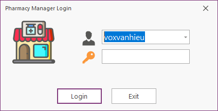
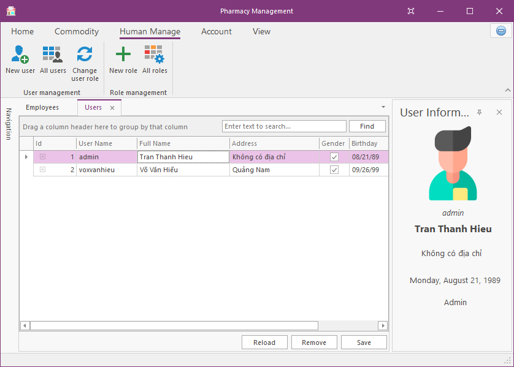
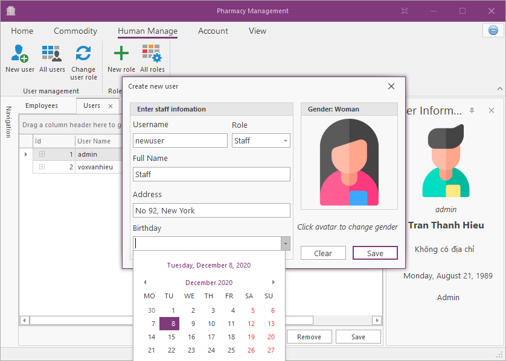
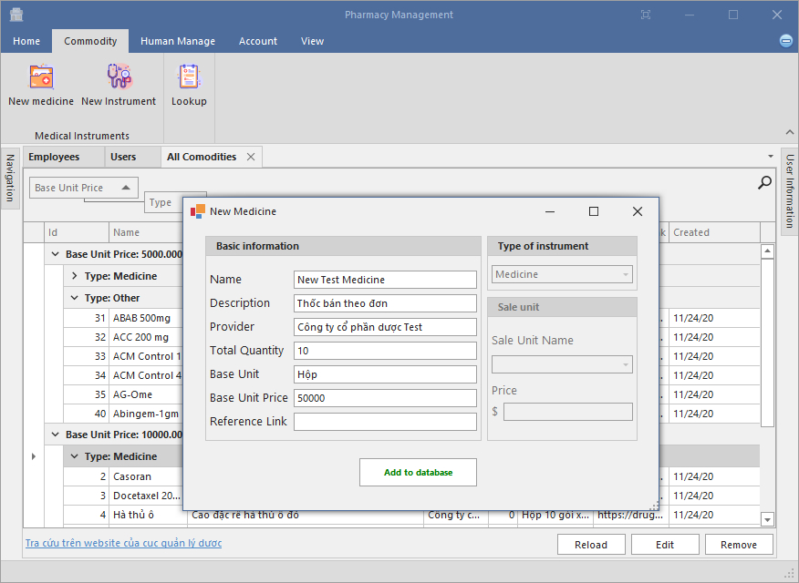
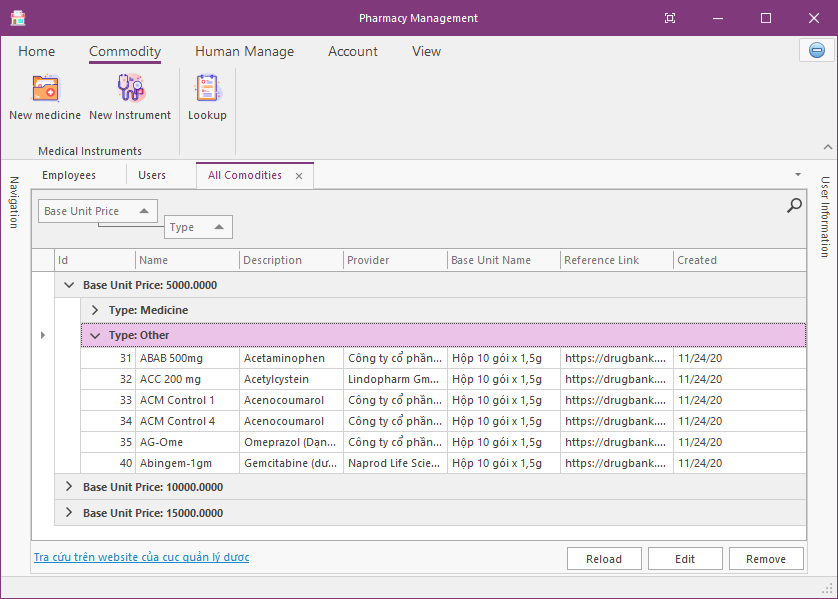
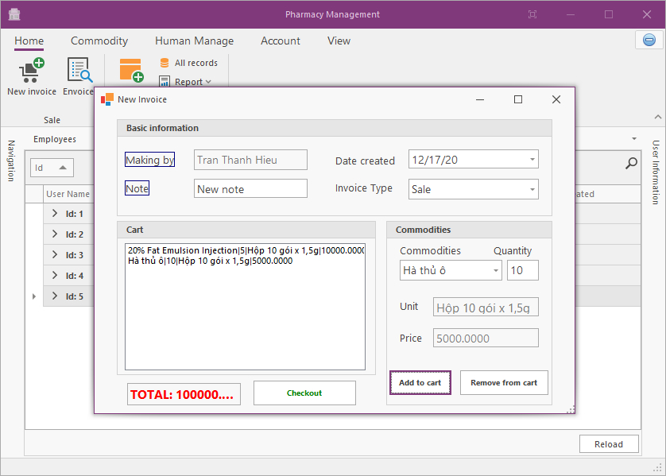
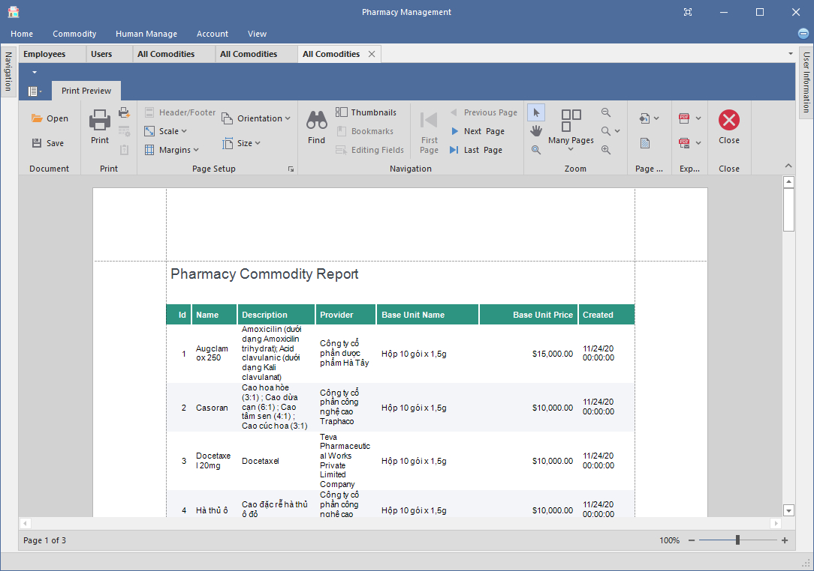
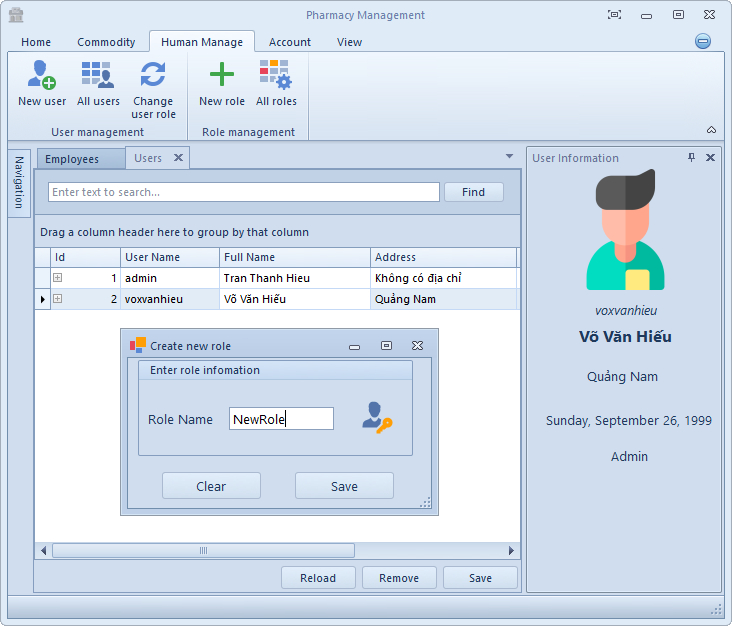

# Pharmacy management

This is my team project for PRN292.

## Technical requires

- C# .NET Framework 4.7
- DevExpress for Winform v20.1
- Entity Framework 6.4
- MSSQL Server (others might not work properly)

## Features

### User role-based identity

The software provides a role-based identity for managing users. By default, there is one admin account with a password is "123@123a". Admin can create other roles, other users then grant role for them. Only role Admin can create new accounts, all others can only manage pharmacy commodity and their own information.

1. Login

   

2. Manage users

   

   

### Commodities and Invoices

1. New commodity (Medicine, tool, others.)

   

2. Manage all commodities (show, search, edit, remove, sort, etc.)

   

3. Invoicing

   

### Other features

1. Print report

   

2. Change theme

   